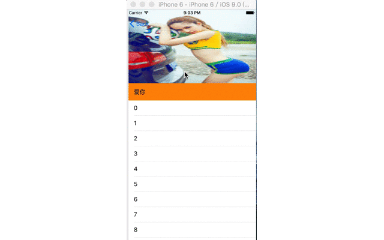

# tableViewdemos
tableView的经典实践的合集

- 核心代码
```
for (UIView *view in self.navigationController.navigationBar.subviews) {
        if ([view isKindOfClass:NSClassFromString(@"_UINavigationBarBackground")]) {
            
            self.backGroundView = view;
            [view removeFromSuperview];
            
        }
    }
    
    [self.navigationController.navigationBar addSubview:self.barBackgroundView];
}
```
控制导航栏的颜色的一个难点在UINavigationBarBackground的颜色以及显示的控制，但是我们又无法影响它，所以我们只能将它移除掉，当离开这个页面的时候，我们再把它添加到tabBar上去，但是有个问题就是当你移除它之后，标题也不会显示了，这个时候需要你去自己添加一个lable，然后当离开这个页面的时候再把它给移除掉
